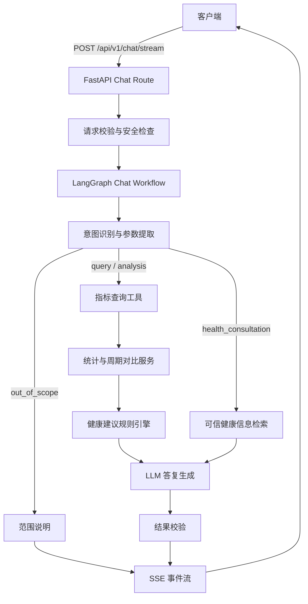

# Chat 接口设计文档

> 状态：设计中  
> 当前版本：v1.2  
> 最后更新：2026-09-21  
> 适用范围：Weight Agent Chat V1

## 1. 文档用途

本文档是 Chat 接口的设计基线，用于持续记录接口契约、工作流、数据边界、关键决策和实施进度。后续需求或实现发生变化时，应先更新对应章节和变更记录，再修改代码。

## 0. 配置管理约定

所有部署相关参数统一由项目根目录 `.env` 管理，并通过 `Settings` 注入应用：

- 服务基础配置：应用名、环境、监听地址、端口和 API 前缀。
- Chat 配置：意图识别阈值、短期记忆 TTL、最大轮次和默认时区/语言。
- Report 配置：报告模型名称、调用超时、温度、最大输出 token 数和 thinking 开关。
- 模型服务配置：模型服务地址和 API 密钥。

规则关键词、意图枚举、路由契约和安全模板属于代码/领域策略，不作为环境变量拆散配置。数据库接入后，数据库连接信息单独增加 `DATABASE_*` 配置分组。

时间表达采用“规则优先、语义分类分层”的策略：明确周期由确定性代码计算日期；“最近一次/最近两次/最近 N 次”表示记录条数，不伪造日期范围，解析结果使用 `latest_count` 交给 Repository 查询最近 N 条记录；“最近的/前阵子”等无法确定范围的表达进入澄清或后续 LLM 时间意图解析。请求中的 `timezone` 优先级高于服务默认时区，最终写入 `NodeContext`、`MetricQuery` 和 `route_execution` 事件。

## 2. V1 目标

Chat 接口需要支持以下能力：

1. 查询用户的体重及相关健康指标数据。
2. 对指定周期的数据进行统计、趋势分析和周期对比。
3. 基于确定性分析结果和健康规则生成饮食、运动及生活方式建议。
4. 回答体重管理相关的通用健康咨询；必要时检索可信网络来源并提供引用。
5. 对非业务问题进行简短、友好的范围说明。
6. 通过 SSE 持续返回处理阶段、文本增量、引用和最终结果。

V1 不包含：

- 疾病诊断、处方、用药调整或紧急医疗决策。
- 允许模型自由生成或执行 SQL。
- 多个自治 Agent 之间的开放式协作。
- 长时间运行的离线报告生成。

## 3. 核心设计决策

| 编号 | 决策 | 原因 | 状态 |
|---|---|---|---|
| ADR-001 | 使用单个 LangGraph 状态图编排 Chat | 需要分支、工具调用、状态保存和失败恢复，但 V1 不需要多 Agent | 已确定；当前使用可替换工作流占位 |
| ADR-002 | 指标查询与统计由确定性服务完成 | 避免 LLM 算错数据或产生不存在的指标 | 已确定 |
| ADR-003 | 建议采用“规则事实 + LLM 表达” | 保证建议有依据，同时保留自然语言体验 | 已确定 |
| ADR-004 | 流式协议采用结构化 SSE 事件 | 前端可以分别展示进度、正文、引用和错误 | 已确定 |
| ADR-005 | 前端使用 `fetch` 消费 POST SSE | 浏览器原生 `EventSource` 不支持 POST 请求体和自定义请求头 | 已确定 |
| ADR-006 | 一期不联网检索，使用模型能力和审核后的业务规则 | 降低 C 端响应延迟、外部依赖和来源治理成本；保留未来扩展点 | 已确定 |
| ADR-007 | V1 不保存 LangGraph checkpoint | 首先保持请求内工作流简单；多轮持久化单独设计 | 暂定 |
| ADR-008 | 通过 Repository 契约隔离未知数据库表结构 | Chat 工作流依赖领域模型而不是具体表和 SQL，后续只替换适配器 | 已确定 |
| ADR-009 | 支持带 TTL 的短期会话记忆，不建立长期用户记忆 | 满足多轮对话，同时降低健康数据长期留存和隐私治理成本 | 已确定 |

## 4. 总体架构



职责边界：

- API 层：鉴权、请求校验、断开检测、SSE 响应头和错误映射。
- LangGraph：控制节点执行顺序和条件分支，不承载业务计算。
- Tool/Service：执行受控查询、统计、比较和规则判断；联网检索属于二期可选扩展。
- LLM：结构化理解用户意图，并根据已验证事实组织自然语言。
- Repository：隔离数据库实现，不向 LLM 暴露数据库连接或任意 SQL 能力。

## 5. 接口契约

### 5.1 端点

```http
POST /api/v1/chat/stream
Content-Type: application/json
Accept: text/event-stream
Authorization: Bearer <token>
```

V1 只提供流式端点。是否补充非流式 `/api/v1/chat`，在前端接入后根据实际需要决定。

### 5.2 请求模型

```json
{
  "conversation_id": "可选；已有会话 ID",
  "message": "帮我分析最近一个月的数据情况，并给出饮食建议",
  "timezone": "Asia/Shanghai",
  "client_context": {
    "locale": "zh-CN"
  }
}
```

字段约束：

| 字段 | 类型 | 必填 | 约束 |
|---|---|---:|---|
| `conversation_id` | string | 否 | UUID；缺省时服务端创建 |
| `message` | string | 是 | 去除首尾空格后 1-4000 字符 |
| `timezone` | string | 否 | IANA 时区；默认取用户资料，仍缺失则使用系统默认时区 |
| `client_context.locale` | string | 否 | V1 默认 `zh-CN` |

`user_id` 不允许由请求体传入，必须来自认证上下文，防止查询其他用户数据。

当前代码阶段使用 `X-User-Id` 请求头作为开发期身份注入占位，便于接口契约测试；它不是生产认证方案。接入正式认证后，应由认证中间件或依赖注入提供 `current_user`，并移除客户端可控的该请求头。

### 5.3 HTTP 响应头

```http
Content-Type: text/event-stream; charset=utf-8
Cache-Control: no-cache
Connection: keep-alive
X-Accel-Buffering: no
```

在 SSE 建连之前发生的认证或请求格式错误，使用普通 HTTP 状态码和 JSON 错误体。SSE 建连之后发生的业务或工具错误，通过 `error` 事件返回。

## 6. SSE 事件协议

所有事件的 `data` 都是单行 JSON。每个事件包含 `request_id`、`sequence` 和 `timestamp`，便于排序和排障。

### 6.1 事件类型

| 事件 | 用途 | 是否可重复 |
|---|---|---:|
| `start` | 确认会话和请求已创建 | 否 |
| `progress` | 展示当前处理阶段 | 是 |
| `data` | 返回意图识别结果、查询范围和核心统计结果 | 是 |
| `delta` | 返回自然语言文本增量 | 是 |
| `citation` | 返回资料来源；一期不发送，二期联网后启用 | 是 |
| `warning` | 数据不足或健康风险提示 | 是 |
| `error` | 流建立后的错误 | 否 |
| `done` | 请求正常结束及最终元数据 | 否 |

### 6.2 示例

```text
event: start
data: {"request_id":"req_123","sequence":1,"timestamp":"2026-09-20T12:00:00Z","conversation_id":"conv_123"}

event: progress
data: {"request_id":"req_123","sequence":2,"timestamp":"2026-09-20T12:00:00Z","stage":"querying","message":"正在查询最近一个月的数据"}

event: data
data: {"request_id":"req_123","sequence":3,"timestamp":"2026-09-20T12:00:01Z","type":"intent_result","intent_result":{"domain":"health_data","intent":"metric_analysis","output_needs":["data","comparison"],"confidence":0.84}}

event: delta
data: {"request_id":"req_123","sequence":4,"timestamp":"2026-09-20T12:00:01Z","content":"最近 30 天，"}

event: done
data: {"request_id":"req_123","sequence":5,"timestamp":"2026-09-20T12:00:03Z","status":"completed"}
```

### 6.3 流行为约束

- `start` 必须是第一个事件。
- 正常结束必须且只能发送一次 `done`。
- `error` 是终止事件，发送后关闭连接，不再发送 `done`。
- 服务端每 15 秒发送 SSE 注释心跳，防止代理关闭空闲连接。
- 客户端断开后，服务端应取消当前图执行和下游 HTTP 请求。
- `delta` 只包含面向用户的正文，不混入调试信息或思维过程。
- 对结构化数据先发送 `data`，再发送依赖这些数据生成的 `delta`。
- 意图识别完成后发送 `data(type=intent_result)`，便于前端和日志系统观测语义判断。
- Supervisor 计划生成后发送 `data(type=supervisor_plan)`，便于观测固定路由、所需 Agent 和是否访问指标数据。

## 7. 意图识别设计

### 7.1 设计原则

意图识别参考常见开源对话系统的做法：分类结果使用固定枚举，槽位单独抽取，低置信度进入澄清分支，模型失败时由规则和模板兜底。V1 不采用让 LLM 自由规划任务的方式。

识别结果不是最终业务结论，只是后续图节点的路由输入。数据库查询、时间归一化和指标计算仍然由确定性代码完成。

### 7.2 分层结果模型

```python
class ChatDomain(str, Enum):
    GENERAL = "general"
    HEALTH_DATA = "health_data"
    HEALTH_KNOWLEDGE = "health_knowledge"
    OUT_OF_SCOPE = "out_of_scope"


class ChatIntent(str, Enum):
    GREETING = "greeting"
    METRIC_QUERY = "metric_query"
    METRIC_ANALYSIS = "metric_analysis"
    DATA_BASED_ADVICE = "data_based_advice"
    DOMAIN_ADVICE = "domain_advice"
    OUT_OF_SCOPE = "out_of_scope"


class OutputNeed(str, Enum):
    DATA = "data"
    COMPARISON = "comparison"
    ADVICE = "advice"


class RiskLevel(str, Enum):
    NONE = "none"
    MEDICAL_REVIEW = "medical_review"
    URGENT = "urgent"


class IntentResult(BaseModel):
    domain: ChatDomain
    intent: ChatIntent
    output_needs: list[OutputNeed]
    entities: QueryEntities
    confidence: float = Field(ge=0, le=1)
    risk_level: RiskLevel = RiskLevel.NONE
    needs_clarification: bool = False
    clarification_question: str | None = None
    reason_codes: list[str] = Field(default_factory=list)
```

`reason_codes` 只记录可审计的分类依据，例如 `contains_metric_name`、`contains_compare_phrase`、`contains_symptom_term`，不记录模型思维过程。

### 7.3 V1 意图枚举

| 意图 | 触发特征 | 后续路由 |
|---|---|---|
| `greeting` | 纯问候、能力介绍或使用引导，不包含业务查询/分析/建议需求 | `greeting_reply` |
| `metric_query` | 查询当前值、历史值或某段时间的指标 | `normalize_query -> query_metrics -> compose_answer` |
| `metric_analysis` | 包含分析、趋势、变化、对比、原因或建议 | `normalize_query -> query_metrics -> analyze_metrics` |
| `data_based_advice` | 明确要求根据自己的数据给出饮食、运动或生活方式建议 | `normalize_query -> query_metrics -> analyze_metrics -> evaluate_rules` |
| `domain_advice` | 不查询个人数据，直接询问体重管理业务范围内的饮食、运动、睡眠建议 | `business_advice -> compose_answer` |
| `out_of_scope` | 与健康数据和健康管理无关 | `scope_reply` |

以下不是普通意图，而是跨意图路由状态：

- `needs_clarification`：关键指标、时间或用户目标缺失，不能可靠执行。
- `risk_level=medical_review`：需要谨慎说明并建议专业咨询。
- `risk_level=urgent`：进入安全模板，不继续普通回答。

### 7.4.1 业务建议的两种入口

饮食建议、运动建议和生活方式建议属于业务范围内能力，不应默认归为泛健康咨询：

1. **数据型建议**：用户明确要求结合自己的体重、BMI、体脂或历史趋势给建议。必须先查询并分析用户数据，再引用分析事实和规则生成建议。
2. **领域型建议**：用户直接询问减脂饮食、早餐搭配、热量控制、运动安排等业务知识，不要求读取个人数据。使用模型能力和已审核的业务知识、规则直接回答，一期不联网。

两者都必须限制在体重管理和生活方式指导范围内。涉及疾病诊断、处方药、药量调整、急症或个体化医疗处置时，转入医疗风险分支。

### 7.4 多需求表达

一句话可以包含多个输出需求，但只保留一个主意图：

| 用户输入 | 主意图 | 输出需求 |
|---|---|---|
| “你好” | `greeting` | 无 |
| “我今天多重？” | `metric_query` | `data` |
| “你好，帮我查一下最近一个月的测量数据” | `metric_query` | `data`；缺少指标时澄清 |
| “分析最近一个月并给饮食建议” | `metric_analysis` | `data, comparison, advice` |
| “和上个月比一下体重，再告诉我怎么吃” | `metric_analysis` | `data, comparison, advice` |
| “根据我的最近体重，给我饮食建议” | `data_based_advice` | `data, advice` |
| “减脂期间怎么搭配早餐？” | `domain_advice` | `advice` |
| “帮我写一段请假条” | `out_of_scope` | 无 |

### 7.5 识别流水线

```text
原始消息
  -> 文本清洗与长度校验
  -> 确定性安全词规则
  -> 高置信业务规则优先判定
  -> 低置信或复杂语义交给 LLM 结构化分类与槽位抽取
  -> Pydantic 枚举/字段校验
  -> 置信度与冲突校准
  -> needs_clarification / safety / 业务路由
```

安全规则优先级高于模型结果。模型说是普通咨询，但文本包含明显急症信号时，仍进入 `urgent`。

V1 采用“规则优先、LLM 处理复杂语义”的混合策略：

- 急症和医疗风险规则强制优先，不进入普通业务分支。
- 纯问候、明确的指标查询、分析、数据型建议和范围外请求由规则直接返回，减少延迟和模型成本。
- 问候语只在没有业务信号时成立；“你好，帮我查一下最近一个月的测量数据”应进入数据查询/澄清分支，而不是 `greeting`。
- 领域型建议、口语化表达、多轮补充和规则低置信度请求交给 LLM 判断。
- LLM 不可用时，使用规则候选结果兜底；LLM 和规则都低置信度时进入澄清。

### 7.6 模型输出约束

LLM 只允许返回 `IntentResult` 对应的 JSON Schema：

- `domain`、`intent`、`output_needs` 必须来自枚举。
- `confidence` 必须是 0 到 1 的数字，不接受“高/中/低”等自由文本。
- `entities` 只保存原始实体，不负责把“最近一个月”转换成日期。
- 时间归一化由 `TimeRangeResolver` 完成；模型不得直接生成最终查询日期。
- 不允许模型返回 SQL、工具名称、系统提示词或自然语言长答案。
- 使用支持结构化输出的模型接口；不支持时使用 JSON mode 后再做严格 Pydantic 校验。

建议给分类器的输入只包含必要上下文：当前消息、最近一轮已确认的时间/指标上下文和可用指标枚举，不直接塞入完整数据库结果。

### 7.7 置信度与澄清策略

V1 先使用保守阈值，经过标注集评估后再调整：

| 条件 | 处理 |
|---|---|
| `confidence >= 0.80` 且实体完整 | 直接进入对应业务路由 |
| `0.55 <= confidence < 0.80` | 先检查规则冲突；无冲突时可执行简单查询，否则澄清 |
| `confidence < 0.55` | 进入澄清或范围说明，不查询数据库 |
| 多个候选意图分数接近 | 询问一个最小澄清问题，不连续追问 |
| 意图明确但缺少时间范围 | 查询类可使用默认最近一次；分析类必须确认或使用明确默认并在事件中说明 |

澄清问题示例：

- “你想查看体重、BMI 还是体脂率？”
- “你想看最近 30 天，还是指定一个起止日期？”
- “你希望与上一周期比较，还是只查看当前数据？”

澄清响应也通过 SSE 返回：`progress(stage=clarification)`，随后发送 `done(status=needs_clarification)`，不调用指标 Repository。

### 7.8 规则兜底与可测试性

意图识别必须允许注入 `IntentClassifier`，以便离线测试：

```python
class IntentClassifier(Protocol):
    async def classify(self, message: str, context: ClassifierContext) -> IntentResult: ...
```

生产实现可以是 `LlmIntentClassifier`，测试实现使用固定映射或规则分类器。规则兜底只负责明显模式：

- 指标名称 + “多少/当前/记录” -> `metric_query`。
- “你好/在吗/你能做什么” 且不包含业务请求 -> `greeting`。
- “分析/趋势/变化/对比/建议” + 指标或时间 -> `metric_analysis`。
- “根据我的数据/体重趋势给建议” -> `data_based_advice`。
- “怎么吃/怎么运动/减脂/早餐/睡眠” -> `domain_advice`。
- 明显非健康主题 -> `out_of_scope`。

规则不能替代完整语义识别，也不能用关键词命中直接判定医疗结论。

### 7.9 评估集

在接入真实模型前，先建立脱敏的意图评估集，每条样本包含：

- 用户原话。
- 期望 `domain`、`intent`、`output_needs`。
- 必填/可选实体。
- 风险级别。
- 是否应该澄清。

首批至少覆盖：单指标查询、范围查询、周期对比、查询+建议、多轮补充、模糊时间、无关问题、症状问题、提示注入和口语/错别字。评估指标包括主意图准确率、澄清准确率、风险召回率和结构化输出成功率。

## 8. LangGraph 状态设计

状态只存储图执行所需的结构化数据，不保存数据库连接、完整网页内容或模型内部推理。

```python
class ChatState(TypedDict, total=False):
    request_id: str
    conversation_id: str
    user_id: str
    message: str
    timezone: str
    locale: str

    intent_result: IntentResult
    intent: ChatIntent
    output_needs: list[OutputNeed]
    entities: QueryEntities
    route: str

    metric_query: MetricQuery
    metric_result: MetricResult
    analysis_result: AnalysisResult
    rule_findings: list[RuleFinding]
    sources: list[HealthSource]  # 二期联网能力使用；一期为空

    answer: str
    warnings: list[ChatWarning]
    error: ChatError | None
```

关键结构：

- `QueryEntities`：指标、时间表达、对比方式、建议类别。
- `MetricQuery`：归一化后的查询参数，只能由服务端验证后生成。
- `MetricResult`：查询结果及数据完整性信息。
- `AnalysisResult`：统计值、变化量、趋势和异常点。
- `RuleFinding`：规则编号、事实、风险级别和建议素材。
- `HealthSource`：标题、URL、机构、发布日期和访问时间。

## 8.1 主 Agent：Chat Supervisor

主 Agent 是 Chat 的统一编排者，不是一个自由回答所有问题的“大模型节点”。它负责把用户请求转换为受控的业务执行计划，并把专业工作交给对应 Agent 或确定性服务。

### 主 Agent 的职责

1. 接收经过 API 校验和认证的用户请求。
2. 读取必要的会话上下文，不直接读取数据库原始数据。
3. 调用意图识别器，得到结构化的 `IntentResult`。
4. 判断请求是否属于体重管理业务范围。
5. 判断是否存在医疗风险、紧急信号或需要人工/专业介入的内容。
6. 判断是否需要澄清指标、时间范围、对比方式或用户目标。
7. 根据意图选择专业 Agent：数据分析 Agent、业务建议 Agent、安全回复或范围回复。
8. 在数据型建议场景中，安排“数据分析 Agent -> 业务建议 Agent”的固定顺序。
9. 只在 Agent 返回结构化结果后组织最终回答流程。
10. 通过 SSE 发布阶段状态，不向用户暴露内部推理过程。

### 主 Agent 不负责的事情

- 不直接生成 SQL，也不选择表名或字段名。
- 不直接计算变化率、趋势、BMI 或其他健康指标。
- 不自行编造健康规则、目标范围或用户数据。
- 不把数据分析 Agent 和业务建议 Agent 的职责混在一起。
- 不绕过安全节点回答高风险医疗问题。
- 不允许用户输入覆盖认证得到的 `user_id`。
- 不在一期调用联网搜索。

### 主 Agent 输入

```python
class SupervisorInput(BaseModel):
    request_id: str
    conversation_id: str
    user_id: str
    message: str
    timezone: str
    locale: str
    conversation_summary: str | None = None
    recent_turns: list[ConversationTurn] = Field(default_factory=list)
    confirmed_entities: QueryEntities | None = None
    last_analysis: AnalysisResult | None = None
```

`user_id` 和会话权限来自服务端上下文；`message` 是经过长度和空白校验的文本；`conversation_summary` 只能是经过裁剪的历史摘要，不直接传入完整敏感历史。

### 主 Agent 输出

```python
class SupervisorPlan(BaseModel):
    route: Literal[
        "greeting",
        "data_analysis",
        "data_based_advice",
        "domain_advice",
        "safety",
        "out_of_scope",
        "clarification",
    ]
    intent_result: IntentResult
    required_agents: list[Literal["data_analysis", "business_advice"]]
    requires_metric_query: bool
    clarification_question: str | None = None
    safety_message: str | None = None
```

主 Agent 的输出必须是可校验的计划，不是最终答案。计划生成后由确定性路由器再次检查：例如 `domain_advice` 不得出现 `requires_metric_query=true`，`safety` 不得继续调用专业建议 Agent。

当前实现采用确定性 `ChatSupervisor` 生成计划：输入是已经通过 Pydantic 校验的 `IntentResult`，输出是 `SupervisorPlan`。一期不让 LLM 自由生成计划，避免工具调用、数据库访问和安全路由不可控。

节点层使用统一的异步协议：节点接收 `SupervisorPlan` 和服务端 `NodeContext`，返回结构化 `NodeResult`。节点不能自行改变路由，也不能绕过计划直接访问未注入的外部资源。

`RouteExecutor` 根据 `SupervisorPlan.route` 调用对应节点。对于 `data_based_advice`，执行顺序固定为 `data_analysis -> business_advice`，不会由模型动态改变。

`DataAnalysisNode` 通过构造函数预留 `MetricRepository` 依赖注入口。数据库表结构确定后，只需注入新的数据库适配器（例如 `SqlMetricRepository`），不需要改动 Supervisor 路由、SSE 协议或业务建议节点。

### 主 Agent 路由表

| 条件 | 路由 | 执行顺序 |
|---|---|---|
| 纯问候、能力介绍或使用引导 | `greeting` | 问候回复模板 |
| 查询个人指标 | `data_analysis` | 数据分析 Agent |
| 分析、对比或趋势 | `data_analysis` | 数据分析 Agent |
| 根据个人数据给建议 | `data_based_advice` | 数据分析 Agent -> 业务建议 Agent |
| 不依赖个人数据的饮食/运动建议 | `domain_advice` | 业务建议 Agent |
| 非业务问题 | `out_of_scope` | 范围回复模板 |
| 需要医疗谨慎或紧急处理 | `safety` | 安全回复模板 |
| 关键参数不足或置信度过低 | `clarification` | 澄清模板 |

### 主 Agent 的确定性护栏

模型计划返回后，必须通过代码护栏：

- `route` 和 `intent_result.intent` 必须匹配允许的映射。
- `required_agents` 必须与路由表一致。
- `greeting`、`safety`、`out_of_scope`、`clarification` 路由不得访问指标 Repository。
- 只有 `data_analysis` 和 `data_based_advice` 可以访问个人数据。
- 业务建议 Agent 只能接收 `AnalysisResult`、`AdviceFacts` 或领域知识上下文。
- 任意模型输出校验失败时，进入安全的错误或澄清分支，不自动执行未知工具。

### 主 Agent 的失败策略

1. 意图模型超时：使用规则分类器处理明显请求；无法确定时澄清。
2. 结构化输出失败：重试一次，仍失败则不调用专业 Agent。
3. 专业 Agent 超时：发送 `warning`，返回已完成的结构化结果或安全降级文案。
4. 用户中途断开：取消当前工作流和下游请求。
5. 未知异常：发送统一 `error` 事件，不返回内部堆栈和提示词。

## 8.2 短期会话记忆与多轮对话

Chat 支持多轮对话，但一期只提供会话级短期记忆，不建立跨会话的长期用户记忆或用户画像。

### 记忆范围

会话记忆通过 `conversation_id` 关联，并且必须同时校验 `user_id`，防止不同用户读取同一个会话：

- 当前会话的用户消息和助手最终答复。
- 已确认的指标、时间范围、时区、对比方式和建议目标。
- 最近一次意图结果和未完成的澄清上下文。
- 一份长度受限的会话摘要，用于较长会话的后续轮次。

不保存模型内部推理过程、无关客户端数据、未经必要性判断的完整数据库结果，或跨会话复用的敏感健康画像。

### 多轮示例

```text
用户：分析我最近一个月的体重
助手：最近 30 天体重下降 1.2 kg，趋势稳定。

用户：那饮食上怎么调整？
```

第二轮通过会话记忆得到最近确认的指标、时间范围和 `AnalysisResult`，因此可以路由为：

```text
data_based_advice -> 使用已有 AnalysisResult/AdviceFacts -> 业务建议 Agent
```

如果上一轮没有成功完成分析，或上下文已经过期，则必须重新查询或向用户澄清，不能假设记忆仍然有效。

### 记忆接口

```python
class ConversationMemory(Protocol):
    async def load(self, user_id: str, conversation_id: str) -> ConversationContext | None: ...
    async def append_turn(self, user_id: str, conversation_id: str, turn: ConversationTurn) -> None: ...
    async def update_context(self, user_id: str, conversation_id: str, context: ConversationContext) -> None: ...
    async def delete(self, user_id: str, conversation_id: str) -> None: ...
```

建议的上下文结构：

```python
class ConversationContext(BaseModel):
    conversation_id: str
    user_id: str
    summary: str | None
    recent_turns: list[ConversationTurn]
    confirmed_entities: QueryEntities | None
    last_intent: ChatIntent | None
    last_analysis: AnalysisResult | None
    expires_at: datetime
```

### 生命周期和容量

一期建议默认：空闲 TTL 24 小时、最多保留 10 个完整轮次、摘要最多 2,000 个字符。超过容量时优先摘要旧轮次，不扩大上下文窗口；收到新请求时续期，过期会话视为新会话。

### 请求生命周期

```text
认证 -> 校验 conversation_id 所属用户 -> load ConversationContext
  -> Supervisor 读取摘要和最近轮次 -> 执行专业 Agent
  -> SSE done 后保存最终轮次和已确认上下文 -> 更新 TTL
```

只有请求正常完成或生成了明确的澄清/安全回复时才写入最终助手轮次。客户端中途断开时，不得把不完整的模型增量当作最终答复。

### 存储实现

- 单进程开发和测试：`InMemoryConversationMemory`。
- 多实例部署：Redis，键格式为 `conversation:{user_id}:{conversation_id}`，设置 TTL。
- 关系数据库只在需要审计、历史查询或合规保留时保存最终轮次，不作为每个图节点的实时共享状态。

LangGraph checkpoint 与会话记忆不是同一个概念：checkpoint 用于恢复图执行，ConversationMemory 用于支持用户下一轮对话。一期先实现会话记忆，不启用跨请求 checkpoint。

### 会话安全

- 不属于当前用户的 `conversation_id` 不得泄露是否存在。
- 日志只记录匿名会话 ID 和事件状态，不记录完整健康数据。
- 删除会话必须同时删除内存/Redis 内容和可选的持久化轮次。
- 会话摘要生成后需要经过长度、敏感字段和提示注入检查。

## 9. LangGraph 节点设计

### 9.1 节点与职责

| 节点 | 类型 | 职责 | 失败策略 |
|---|---|---|---|
| `greeting_reply` | 模板 | 回复纯问候、能力介绍和使用引导 | 无模型依赖 |
| `load_memory` | 确定性工具 | 按 `user_id + conversation_id` 读取短期会话上下文 | 不可用时降级为无记忆的单轮请求 |
| `guard_request` | 确定性 + 可选模型 | 检查空输入、提示注入、紧急健康风险 | 高风险进入安全回复；格式错误终止 |
| `understand_request` | 规则 + LLM 结构化输出 | 识别领域、主意图、输出需求、实体、风险和置信度 | 结构化校验失败重试一次，再用规则兜底 |
| `normalize_query` | 确定性 | 解析时区、时间范围、指标别名和默认对比周期 | 参数不足时生成澄清问题 |
| `query_metrics` | 工具 | 通过受控 Repository 查询用户数据 | 数据库瞬时错误有限重试 |
| `analyze_metrics` | 确定性 | 计算统计、趋势、周期变化和数据完整性 | 计算错误终止；数据少则 warning |
| `evaluate_rules` | 确定性 | 生成有编号、可追溯的建议事实 | 缺规则时降级为一般建议素材 |
| `compose_answer` | LLM | 仅根据状态中的事实和来源组织回答 | 一次重试；失败返回结构化数据摘要 |
| `validate_answer` | 确定性 + 可选模型 | 核验数字、引用、医疗边界和输出范围 | 删除无依据内容或使用安全模板 |
| `scope_reply` | 模板 | 回复非业务问题 | 无模型依赖 |
| `safety_reply` | 模板 | 紧急或高风险健康场景提示 | 无模型依赖 |
| `clarification_reply` | 模板 | 关键实体缺失或意图置信度不足时提问 | 不调用数据库 |
| `save_memory` | 确定性工具 | 保存完整轮次、已确认实体和必要分析结果并续期 TTL | 保存失败不改变已生成答复，记录告警 |

### 9.2 图路由

```text
START
  -> load_memory
  -> guard_request
      -> safety_reply -> END
      -> understand_request
          -> greeting -> greeting_reply -> END
          -> out_of_scope -> scope_reply -> END
          -> needs_clarification -> clarification_reply -> END
          -> urgent -> safety_reply -> END
          -> metric_query -> normalize_query -> query_metrics
          -> metric_analysis -> normalize_query -> query_metrics
          -> data_based_advice -> normalize_query -> query_metrics
          -> domain_advice -> business_advice

query_metrics
  -> 仅查询 -> compose_answer
  -> 需要比较/建议 -> analyze_metrics -> evaluate_rules -> compose_answer

evaluate_rules -> compose_answer
business_advice -> compose_answer
compose_answer -> validate_answer -> save_memory -> END
```

当前 Workflow 已通过 `route_execution` SSE `data` 事件发布节点执行结果和执行顺序；数据分析、业务建议节点目前返回占位结果，待后续接入 Repository、分析服务和建议生成器。当前 Repository 仅作为依赖注入口，不会在占位节点中提前执行查询。

`route_execution` 至少包含 `route`、`status`、`timezone`、`node_results` 和 `data`。数据型路由的 `data` 中包含时间解析结果与查询计划；最近 N 条请求使用 `latest_count/latest_query`，周期请求使用 `time_resolution/metric_query`。

### 9.3 是否需要任务拆分

“分析最近一个月的数据，并给出饮食建议”需要拆分，但拆分为固定、可观测的图节点，而不是让 Planner 自由生成任意任务：

1. 解析“最近一个月”和用户时区。
2. 确定默认对比基线为之前连续 30 天。
3. 查询两个周期的数据。
4. 计算统计、趋势和数据质量。
5. 应用健康建议规则。
6. 生成并校验答复。

只有未来出现大量动态工具、任务顺序无法预先定义时，才考虑增加 Planner 节点。

## 10. 数据查询与对比约定

### 10.1 时间语义

- “最近 7 天/30 天/一个月”：截至用户当地时间的当前日期，使用滚动周期。
- “本周/上周”：按用户当地时间的自然周，周一为首日。
- “本月/上个月”：按用户当地时间的自然月。
- 用户明确给出起止日期时，优先使用用户范围。
- 请求中的模糊时间必须归一化为闭区间日期，并在 `data` 事件中返回实际范围。

### 10.2 默认对比

- 用户要求“分析”但未指定基线时，默认与紧邻的等长上一周期比较。
- 用户只要求“查询”时，不自动执行对比。
- 数据少于 3 个有效观测点时，不输出趋势结论。
- 数据覆盖率不足时返回 `warning`，建议中说明不确定性。

### 10.3 统计职责

分析服务负责计算，而不是 LLM：

- 首值、末值、最小值、最大值、平均值和中位数。
- 绝对变化、变化率和日均/周均变化速度。
- 线性趋势方向及斜率。
- 目标区间达标率。
- 数据覆盖率和最长缺失区间。
- 与基线周期的差异。

### 10.4 数据库未定时的领域契约

当前只确定数据来自数据库，物理表结构和数据库类型尚未确定。V1 先定义 Chat 所需的最小领域模型，数据库层负责把实际字段映射为该模型。

```python
class MetricType(str, Enum):
    WEIGHT = "weight"
    BMI = "bmi"
    BODY_FAT_RATE = "body_fat_rate"
    WAIST_CIRCUMFERENCE = "waist_circumference"


class MetricObservation(BaseModel):
    metric: MetricType
    value: Decimal
    unit: str
    measured_at: datetime
    source: str | None = None


class MetricQuery(BaseModel):
    user_id: str
    metrics: set[MetricType]
    start_at: datetime
    end_at: datetime
    timezone: str


class MetricResult(BaseModel):
    observations: list[MetricObservation]
    available_metrics: set[MetricType]
    queried_at: datetime
```

约束：

- `measured_at` 在服务内部统一为带时区的 UTC 时间，展示和自然日计算时转换到用户时区。
- `value` 使用 `Decimal`，避免关键数值在数据库与 Python 间产生不必要的浮点误差。
- Repository 返回统一标准单位；原始单位换算在数据库适配层完成。
- `source` 只标识数据来源类型，例如 `manual`、`scale`、`device_api`，不暴露设备密钥。
- 领域模型不包含数据库主键、表名、ORM 关系或供应商字段。

首期指标枚举仍需业务确认。在确认之前，不应将任意字符串指标直接透传到 SQL。

### 10.5 Repository 契约

LangGraph 的 `query_metrics` 节点只依赖抽象接口：

```python
class MetricRepository(Protocol):
    async def list_available_metrics(self, user_id: str) -> set[MetricType]: ...

    async def get_observations(self, query: MetricQuery) -> MetricResult: ...

    async def get_latest_observations(
        self,
        user_id: str,
        metrics: set[MetricType],
        before: datetime | None = None,
    ) -> list[MetricObservation]: ...
```

设计要求：

- 所有方法必须显式携带 `user_id`，查询条件必须强制按用户隔离。
- Repository 不接收自然语言、不接收 LLM 生成的 SQL，也不返回 ORM 实例。
- 查询参数先经过指标白名单和最大时间范围校验。
- 数据库异常转换为领域错误，例如 `DataSourceUnavailable`，不向图泄漏驱动异常。
- 单次查询返回数量设置上限；长周期分析优先由 SQL 聚合或分桶。
- Repository 的排序约定为 `measured_at` 升序，并明确重复时间点的处理策略。

### 10.6 数据库适配策略

数据库表确定后新增一个实现，例如 `SqlMetricRepository`：

```text
LangGraph query_metrics 节点
        -> MetricRepository 接口
            -> SqlMetricRepository
                -> ORM/SQL 查询
                    -> 实际数据库表
```

适配过程只需要完成：

1. 将实际用户字段映射到 `user_id`。
2. 将指标字段或指标行映射到 `MetricType`。
3. 将原始值和单位转换为标准单位。
4. 将数据库时间转换为 UTC aware datetime。
5. 补充 Repository 集成测试和典型查询索引。

在表结构确定前，可以使用 `InMemoryMetricRepository` 和固定测试数据并行开发 Chat schema、SSE、LangGraph 路由及分析服务。该实现只用于测试和本地演示，不进入生产环境。

### 10.7 对未来表结构的最低要求

无论最终采用宽表还是指标明细表，数据库至少需要表达：

- 数据所属用户。
- 指标类型或可映射的指标字段。
- 指标值和单位。
- 实际测量时间。
- 可选的数据来源。
- 创建时间；如允许修改历史数据，还需要更新时间。

建议建立覆盖 `user_id + metric + measured_at` 的查询索引。若采用每个指标独立列的宽表，则根据实际查询方式为 `user_id + measured_at` 建立复合索引。

## 11. 建议生成约束

建议链路为：

```text
查询事实 -> 分析事实 -> 规则命中 -> 建议素材 -> LLM 表达 -> 结果校验
```

每条规则至少包含：

- `rule_id` 和版本。
- 适用指标和人群条件。
- 可执行的确定性条件。
- 风险级别。
- 建议素材和禁用表述。
- 规则依据或维护来源。

LLM 不得：

- 修改统计结果或编造缺失数据。
- 将相关性表述为医学诊断。
- 推荐处方药、调整药量或替代医生意见。
- 在没有检索来源时生成虚假引用。

## 12. 联网能力与安全边界

### 12.1 一期不联网的决策

一期不调用搜索引擎、网页抓取或外部健康知识 API。领域型建议使用模型自身能力、版本化业务规则和审核后的提示模板完成。

这样做的主要原因：

- C 端体验优先，减少外部网络带来的首字节延迟和超时。
- 避免网页内容质量、广告、版权和来源可信度治理成为一期阻塞点。
- 饮食建议的主要场景是稳定的体重管理知识，不要求实时资讯。
- 保持 SSE 流程简单，先验证用户是否真正需要实时资料引用。

模型回答中不得伪造论文、机构、URL 或“最新指南”引用。用户明确要求最新研究、政策或指南时，一期应诚实说明当前不提供实时检索，并给出通用范围内的谨慎回答或建议咨询专业人士。

### 12.2 后续联网扩展点

未来如确有需要，新增独立的 `knowledge_retrieval` 子图或工具，不改变 `domain_advice` 和 `data_based_advice` 的输入输出契约。接入前需要单独评估来源白名单、缓存、超时、引用校验和隐私边界。

### 12.3 安全升级

当用户描述急症信号、自伤风险或明显需要诊疗的情况时，停止普通建议流程，返回安全模板，说明应联系当地急救服务或专业医疗人员。具体触发词和策略需要医学审核。

## 13. 错误模型

统一错误码建议：

| 错误码 | 场景 | 是否可重试 |
|---|---|---:|
| `INVALID_REQUEST` | 请求字段或时间范围无效 | 否 |
| `AUTH_REQUIRED` | 缺少或无效身份 | 否 |
| `CLARIFICATION_REQUIRED` | 关键参数无法可靠推断 | 否，需用户补充 |
| `DATA_NOT_FOUND` | 时间范围内没有数据 | 否 |
| `DATA_INSUFFICIENT` | 数据可查但不足以分析 | 否 |
| `DEPENDENCY_TIMEOUT` | 数据库、模型或搜索超时 | 是 |
| `MODEL_OUTPUT_INVALID` | 模型结构化结果校验失败 | 是，服务端有限重试 |
| `INTERNAL_ERROR` | 未分类内部错误 | 视情况 |

错误响应不得包含堆栈、SQL、模型密钥或内部提示词。

## 14. 会话与持久化边界

V1 已确定使用带 TTL 的短期会话记忆支持多轮对话；它不等同于长期聊天历史或 LangGraph checkpoint。

最低要求：

- 保存用户消息、最终助手消息、时间戳和会话 ID。
- 保存本次使用的时间范围、指标、规则版本和引用 URL，便于审计。
- 不保存模型思维过程。
- 日志中对用户健康数据做最小化记录和必要脱敏。

待决定：

- 对话历史保留期限。
- 是否允许用户删除单条消息或整个会话。
- 多轮对话使用 `ConversationMemory`，不启用跨请求 LangGraph checkpoint。
- 会话标题生成方式。

## 15. 建议代码结构

```text
src/weight_agent/
  api/
    routes/chat.py
    schemas/chat.py
    sse.py
  chat/
    graph.py
    state.py
    routing.py
    nodes/
      guard.py
      understand.py
      normalize.py
      query_metrics.py
      analyze.py
      evaluate_rules.py
      search.py
      compose.py
      validate.py
  domain/
    metrics/models.py
    metrics/service.py
    advice/models.py
    advice/rules.py
  repositories/
    metric_repository.py
    conversation_repository.py
  integrations/
    llm/client.py
    search/client.py
  core/
    config.py
    errors.py
    logging.py
```

约束：API schema、图状态、领域模型和数据库模型必须分离，避免一个 Pydantic 模型承担所有层的职责。

## 16. 非功能要求

### 性能目标

- 建连后 1 秒内发送 `start`。
- 无联网的查询类请求，P95 首个有效内容事件小于 3 秒。
- 一期不包含联网请求；二期如启用联网，再单独设定检索超时和首字节目标。
- 单次 Chat 请求设置总超时；具体数值在模型和搜索供应商确定后压测设定。

### 可观测性

每次请求至少记录：

- `request_id`、`conversation_id`、用户匿名标识。
- 图节点开始、结束、耗时和结果状态。
- 数据库、LLM、搜索调用耗时和错误类型。
- 模型名称、提示模板版本和 token 用量。
- 不记录完整健康数据和模型密钥。

### 测试

- 单元测试：时间解析、统计计算、规则命中和 SSE 编码。
- 契约测试：请求 schema、事件顺序和错误码。
- 图测试：每一种意图分支、降级和重试路径。
- 集成测试：数据库查询、模型结构化输出和断开取消。
- 安全测试：跨用户访问、提示注入、虚假引用和医疗越界。

## 17. 实施计划与进度

| 阶段 | 内容 | 状态 |
|---|---|---|
| 0 | 服务骨架、Python 3.11、基础测试 | 已完成 |
| 1 | Chat 需求边界、接口和图设计 | 进行中 |
| 2 | Chat schema、SSE 基础设施、可替换工作流、内存数据适配器 | 已完成（占位实现） |
| 3 | 意图识别、时间归一化和路由 | 已完成规则优先的混合意图识别，并已接入 ChatWorkflow；真实 LLM Client、时间归一化与 Supervisor 待开发 |
| 3a | Chat Supervisor 职责、输入输出契约和确定性护栏 | 已实现确定性 SupervisorPlan 生成、模型护栏和 Workflow 接入 |
| 3c | Chat 节点协议与一期节点实现 | 已完成统一 NodeContext/NodeResult 协议、模板回复节点和业务占位节点 |
| 3b | 短期会话记忆与多轮对话 | 已完成内存版契约和测试，Redis 适配待后续实现 |
| 4 | 指标 Repository、查询与分析服务 | 未开始 |
| 5 | 规则引擎与建议生成 | 未开始 |
| 6 | 可选联网健康检索、引用与安全策略 | 后续评估，不属于一期 |
| 7 | 会话持久化、可观测性和端到端测试 | 未开始 |

## 18. 开发前待确认事项

以下事项会影响下一阶段的数据模型和接口实现：

1. 首期支持哪些指标，例如体重、BMI、体脂率、腰围、基础代谢。
2. 数据库类型、表结构、字段定义、单位规则和数据量级。
3. 身高、性别、年龄、目标体重等用户资料由哪个服务提供。
4. 首期接入哪个 LLM，是否需要兼容多个模型供应商。
5. 是否需要二期联网搜索，以及搜索供应商和可信来源白名单。
6. 用户认证方式及 `user_id` 如何注入请求上下文。
7. 是否需要保存多轮会话，以及数据保留期限。
8. 健康规则由谁审核和维护。

## 19. 变更记录

| 日期 | 版本 | 变更 | 决策人 |
|---|---|---|---|
| 2026-09-20 | v0.1 | 建立 Chat V1 总体架构、接口、SSE 和 LangGraph 设计基线 | 待确认 |
| 2026-09-20 | v0.2 | 确认数据来自数据库；增加数据库无关领域模型、Repository 契约和未知表结构适配策略 | 待确认 |
| 2026-09-20 | v0.3 | 实现 Chat 请求模型、SSE 事件流、可替换工作流和内存指标 Repository；补充接口契约测试 | 待确认 |
| 2026-09-20 | v0.4 | 完成分层意图模型、置信度/澄清策略、规则兜底和意图评估集设计 | 待确认 |
| 2026-09-20 | v0.5 | 确定一期不联网；领域建议使用模型能力和审核规则，联网能力延后评估 | 待确认 |
| 2026-09-20 | v0.6 | 完成 Chat Supervisor 主 Agent 的职责、路由表、输入输出契约和失败策略设计 | 待确认 |
| 2026-09-20 | v0.7 | 增加带 TTL 的短期会话记忆、多轮上下文契约和 load/save 节点设计 | 待确认 |
| 2026-09-21 | v0.8 | 实现 ConversationMemory 协议和 InMemoryConversationMemory，增加用户隔离、TTL、轮次上限和删除测试 | 待确认 |
| 2026-09-21 | v0.9 | 实现 IntentClassifier 协议和 ClassifierContext，增加结构化实现与上下文边界测试 | 待确认 |
| 2026-09-21 | v1.0 | 实现 RuleBasedIntentClassifier，覆盖查询、分析、建议、范围外和风险分支，并增加多轮追问测试 | 待确认 |
| 2026-09-21 | v1.1 | 实现 LlmIntentClassifier 和 StructuredOutputClient 协议，增加 JSON Schema、Pydantic 校验及非法输出测试 | 待确认 |
| 2026-09-21 | v1.2 | 实现 HybridIntentClassifier，增加风险优先、LLM 失败回退和低置信度澄清策略 | 待确认 |
| 2026-09-22 | v1.3 | 重构 HybridIntentClassifier 为“安全规则强制优先、明确业务规则优先、复杂语义交给 LLM”的混合识别策略 | 待确认 |
| 2026-09-22 | v1.4 | 将 HybridIntentClassifier 接入 ChatWorkflow，通过 SSE 返回 `data(type=intent_result)`，并支持澄清分支结束状态 | 待确认 |
| 2026-09-22 | v1.5 | 实现确定性 ChatSupervisor，将 `IntentResult` 转换为 `SupervisorPlan`，并通过 SSE 返回 `data(type=supervisor_plan)` | 待确认 |
| 2026-09-22 | v1.6 | 增加 `greeting` 意图与路由，纯问候走模板回复；复合问候加业务请求仍进入业务路由 | 待确认 |
| 2026-09-22 | v1.7 | 新增 `chat/node.py`，定义 ChatNode 协议、NodeContext/NodeResult，以及问候、澄清、安全、范围、数据分析和业务建议节点 | 待确认 |
| 2026-09-22 | v1.8 | 新增 `RouteExecutor` 并接入 ChatWorkflow，固定执行路由节点；`data_based_advice` 按数据分析后业务建议顺序执行 | 待确认 |
| 2026-09-22 | v1.9 | 为 `DataAnalysisNode` 和 `RouteExecutor` 预留 `MetricRepository` 注入口，数据库未就绪时保持占位执行 | 待确认 |
| 2026-09-22 | v1.10 | 统一服务、Chat、Report 和模型服务配置分组，新增 Chat 意图阈值与会话参数的 `.env` 配置 | 待确认 |
| 2026-09-22 | v1.11 | 稳定时间表达解析：支持滚动周期、自然周期、明确日期区间及最近 N 条记录，并区分 `latest_count` 与日期范围 | 待确认 |
| 2026-09-22 | v1.12 | 完成请求时区到 NodeContext、MetricQuery 和 route_execution 的传递，补齐默认时区和最近 N 条查询计划输出 | 待确认 |
